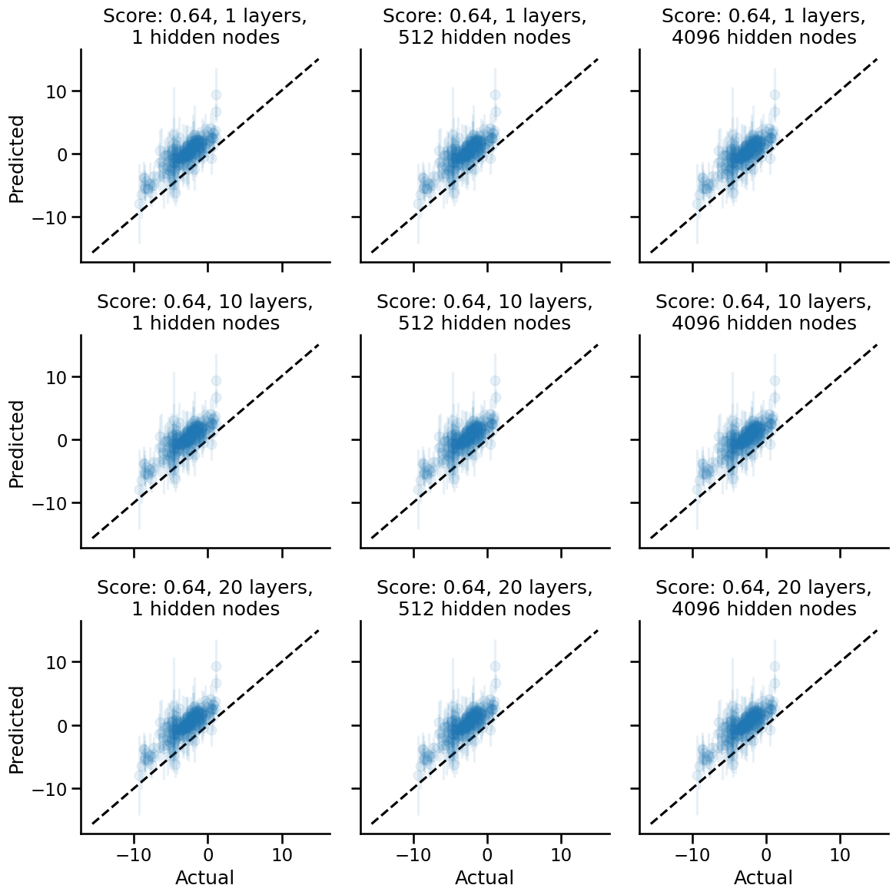
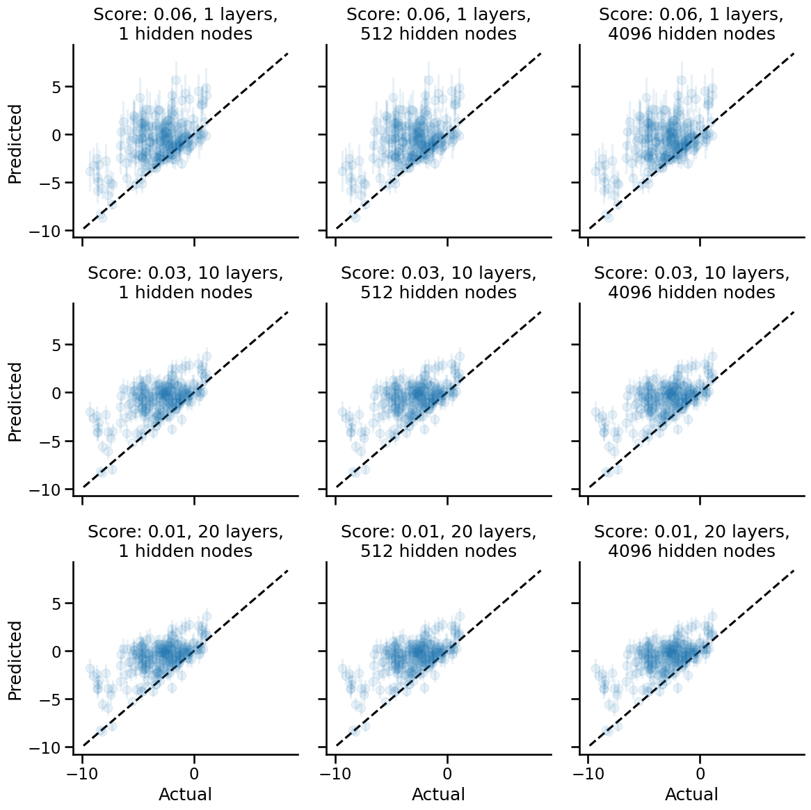
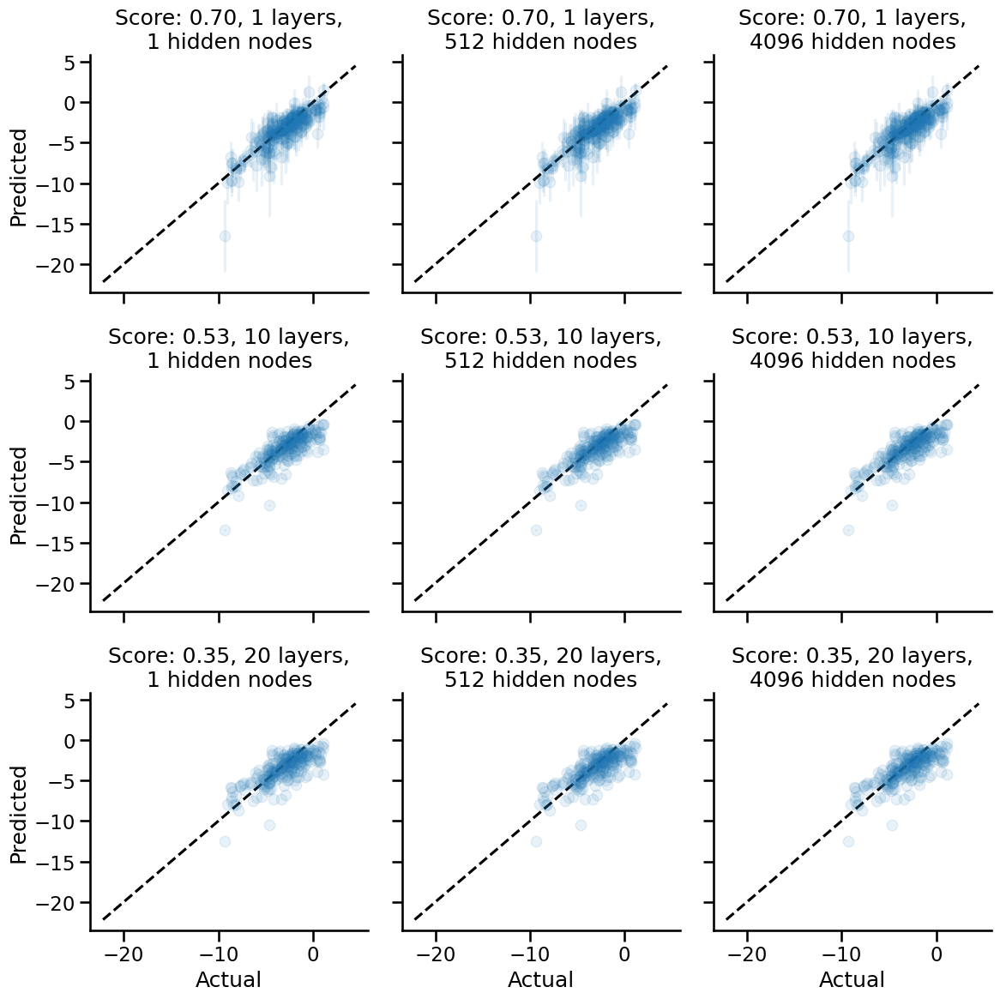
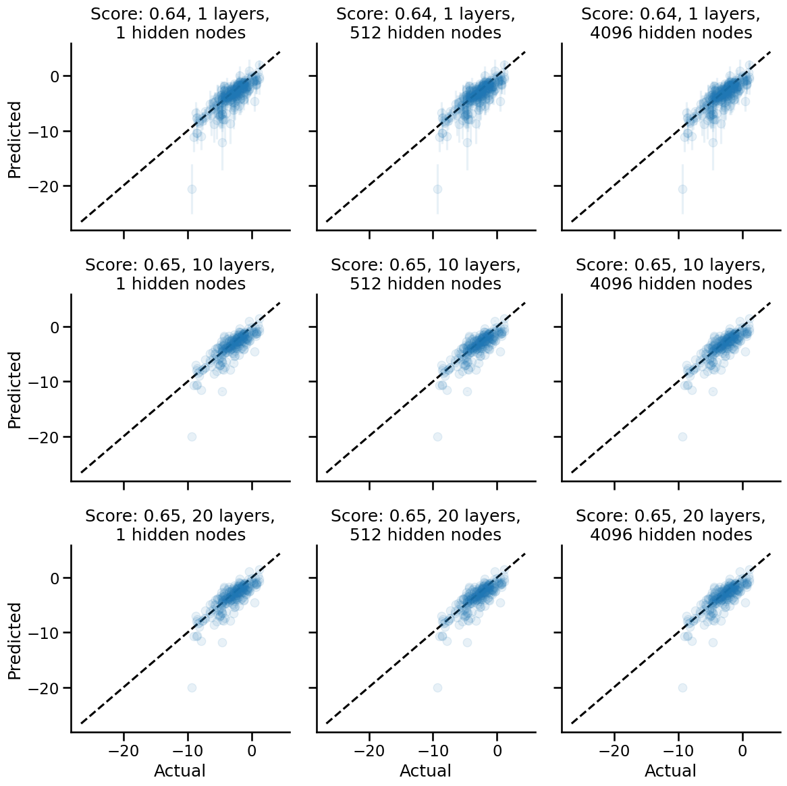
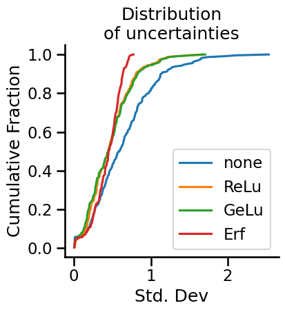
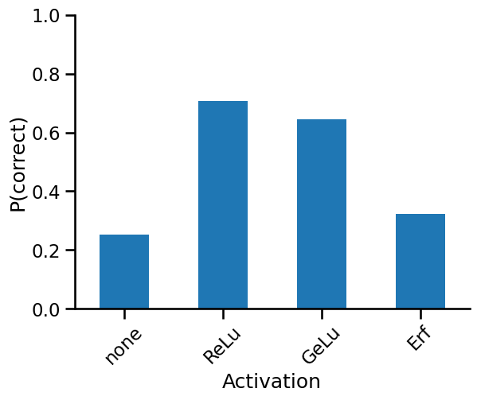

# How useful are infinitely wide neural networks?

In this notebook,
I would like to explore the use of the Neural Tangents package
for doing cheminformatics tasks.

For the non-cheminformatician reading this,
cheminformatics tasks should be treated as a surrogate
for complex modelling problems that do not have
an obvious input-output relationship structure
that can be easily written in an equation,
hence necessitating the use of a neural network.

The goal here is not to see
how we can achieve state-of-the-art (SOTA) performance,
but instead empirically explore how infinitely wide neural networks
could possibly be leveraged to improve a data scientist's workflow
and solve complex problems.
As such, you won't see us try to tweak hyperparameters
to squeeze out maximum performance.
Rather, you'll see what we hope to be is a systematic exploration
of how neural network architectures
affect their infinite-width limit performance.

## Motivation for this notebook

Given the popularity of neural networks
and their productive use in applications,
it sort of begs the question,
why would one want to be interested in infinitely-wide neural networks
as an applied topic?


### Practical implications for predictive modelling

Putting aside the really fascinating theoretical connections
between Gaussian Processes and infinitely wide neural networks,
I saw some potentially attractive practical implications
of infinitely wide neural networks.
In particular, having read the original paper,
and studying the code,
I had this hunch that infinitely wide neural networks
could save us deep learners from a wide swathe
of Sisyphean hyperparameter tuning tasks,
such as tuning learning rate, number of hidden nodes,
number of epochs, and more.


### Curiousity surrounding kernels

Having read the paper, I had this hunch that infinitely wide neural networks
should give us different Gaussian Process kernels
depending on the neural network architecture.
As we know from GP literature,
the kernel,
which is a function of the distance between data points in input space,
dictates the behaviour of a GP.
Kernels are compositionally additive,
and can thus be used to simultaneously model
short-range and long-range behaviour,
at least in 1-D examples that I have seen.

## Try MoleculeNet's ESOL

The dataset that we will focus on here is MoleculeNet's solubility dataset.


```python
%load_ext autoreload
%autoreload 2
%load_ext watermark
```


```python
import pandas as pd
import janitor
import janitor.chemistry
import os

from jax.config import config
import seaborn as sns

sns.set_context("talk")

config.update("jax_enable_x64", True)
os.environ["XLA_PYTHON_CLIENT_ALLOCATOR"] = "platform"
```

The dataset is already well-cleaned;
the column that is the input to our models will be the "smiles" column
(converted into a 2048-bit Morgan-2 fingerprint),
while the target column is
the "measured log solubility in mols per litre" column.


```python
# Reset index to guarantee contiguous indexing.
# Will be useful later.
data = pd.read_csv("https://deepchemdata.s3-us-west-1.amazonaws.com/datasets/delaney-processed.csv").smiles2mol("smiles", "mol").reset_index(drop=True)
data.head()
```


<div>
<style scoped>
    .dataframe tbody tr th:only-of-type {
        vertical-align: middle;
    }

    .dataframe tbody tr th {
        vertical-align: top;
    }

    .dataframe thead th {
        text-align: right;
    }
</style>
<table border="1" class="dataframe">
  <thead>
    <tr style="text-align: right;">
      <th></th>
      <th>Compound ID</th>
      <th>ESOL predicted log solubility in mols per litre</th>
      <th>Minimum Degree</th>
      <th>Molecular Weight</th>
      <th>Number of H-Bond Donors</th>
      <th>Number of Rings</th>
      <th>Number of Rotatable Bonds</th>
      <th>Polar Surface Area</th>
      <th>measured log solubility in mols per litre</th>
      <th>smiles</th>
      <th>mol</th>
    </tr>
  </thead>
  <tbody>
    <tr>
      <th>0</th>
      <td>Amigdalin</td>
      <td>-0.974</td>
      <td>1</td>
      <td>457.432</td>
      <td>7</td>
      <td>3</td>
      <td>7</td>
      <td>202.32</td>
      <td>-0.77</td>
      <td>OCC3OC(OCC2OC(OC(C#N)c1ccccc1)C(O)C(O)C2O)C(O)...</td>
      <td>&lt;rdkit.Chem.rdchem.Mol object at 0x7febddddaff0&gt;</td>
    </tr>
    <tr>
      <th>1</th>
      <td>Fenfuram</td>
      <td>-2.885</td>
      <td>1</td>
      <td>201.225</td>
      <td>1</td>
      <td>2</td>
      <td>2</td>
      <td>42.24</td>
      <td>-3.30</td>
      <td>Cc1occc1C(=O)Nc2ccccc2</td>
      <td>&lt;rdkit.Chem.rdchem.Mol object at 0x7febddddb060&gt;</td>
    </tr>
    <tr>
      <th>2</th>
      <td>citral</td>
      <td>-2.579</td>
      <td>1</td>
      <td>152.237</td>
      <td>0</td>
      <td>0</td>
      <td>4</td>
      <td>17.07</td>
      <td>-2.06</td>
      <td>CC(C)=CCCC(C)=CC(=O)</td>
      <td>&lt;rdkit.Chem.rdchem.Mol object at 0x7febddddb0d0&gt;</td>
    </tr>
    <tr>
      <th>3</th>
      <td>Picene</td>
      <td>-6.618</td>
      <td>2</td>
      <td>278.354</td>
      <td>0</td>
      <td>5</td>
      <td>0</td>
      <td>0.00</td>
      <td>-7.87</td>
      <td>c1ccc2c(c1)ccc3c2ccc4c5ccccc5ccc43</td>
      <td>&lt;rdkit.Chem.rdchem.Mol object at 0x7febddddb140&gt;</td>
    </tr>
    <tr>
      <th>4</th>
      <td>Thiophene</td>
      <td>-2.232</td>
      <td>2</td>
      <td>84.143</td>
      <td>0</td>
      <td>1</td>
      <td>0</td>
      <td>0.00</td>
      <td>-1.33</td>
      <td>c1ccsc1</td>
      <td>&lt;rdkit.Chem.rdchem.Mol object at 0x7febddddb1b0&gt;</td>
    </tr>
  </tbody>
</table>
</div>


```python
import jax.numpy as np
morgans = data.morgan_fingerprint("mol", radius=3, nbits=2048)
morgans = np.array(morgans)
morgans
```


    Array([[0., 1., 0., ..., 0., 0., 0.],
           [0., 0., 0., ..., 0., 0., 0.],
           [0., 0., 0., ..., 0., 0., 0.],
           ...,
           [0., 0., 0., ..., 0., 0., 0.],
           [0., 1., 0., ..., 0., 0., 0.],
           [0., 0., 0., ..., 0., 0., 0.]], dtype=float64)


```python
task = "SOLUBILITY"
target_col_mapping = {
    "LIPO": "exp",
    "SOLUBILITY": "measured log solubility in mols per litre",
}
targets = data[target_col_mapping[task]]
targets = np.array(targets).reshape(-1, 1)
targets.shape
```


    (1128, 1)


## Writing infinitely wide neural networks

Infinitely wide neural networks are written
using the neural tangents library developed by Google Research.
It is based on JAX, and provides a neural network library
that lets us analytically obtain the infinite-width kernel
corresponding to the particular neural network architecture specified.
This is known as a _Neural Network Gaussian Process_ (NNGP) kernel.

I will primarily be concerned with the NNGP kernel
rather than the Neural Tangent Kernel (NTK).
Mostly for simplicity's sake;
being the lazy person I am,
I'll try avoiding adding an orthogonal and combinatorial axis of complexity
wherever possible.

Here is an example infinitely-wide neural network
with two hidden layers,
each with 4096 hidden nodes.


```python
from jax import jit
import neural_tangents as nt
from neural_tangents import stax

N_HIDDEN = 4096

init_fn, apply_fn, kernel_fn = stax.serial(
    stax.Dense(N_HIDDEN, W_std=1.5, b_std=0.05), stax.Erf(),
    stax.Dense(N_HIDDEN, W_std=1.5, b_std=0.05), stax.Erf(),
    stax.Dense(1),
)

apply_fn = jit(apply_fn)
kernel_fn = jit(kernel_fn, static_argnums=(2,))
```

    2022-12-23 14:34:25.930704: W tensorflow/compiler/xla/stream_executor/platform/default/dso_loader.cc:64] Could not load dynamic library 'libnvinfer.so.7'; dlerror: libnvinfer.so.7: cannot open shared object file: No such file or directory
    2022-12-23 14:34:25.930781: W tensorflow/compiler/xla/stream_executor/platform/default/dso_loader.cc:64] Could not load dynamic library 'libnvinfer_plugin.so.7'; dlerror: libnvinfer_plugin.so.7: cannot open shared object file: No such file or directory
    2022-12-23 14:34:25.930789: W tensorflow/compiler/tf2tensorrt/utils/py_utils.cc:38] TF-TRT Warning: Cannot dlopen some TensorRT libraries. If you would like to use Nvidia GPU with TensorRT, please make sure the missing libraries mentioned above are installed properly.


### Initial model params

For benchmarking purposes, we want to obtain the parameters at initialization
in order to compare how the NNGP kernel conditioned on observed data
compares against the initialized, unfitted model.


```python
from jax import random as rnd
key = rnd.PRNGKey(71)
input_shape, params = init_fn(key, input_shape=(2048,))

```

## Preprocessing of data

We are going to use a fixed split, again, for simplicity purposes.
To take advantage of JAX's deterministic random number generation capabilities,
I have written my own train/test split function.

We will bring all of our inputs into a standardized Gaussian space,
mostly to ensure that our inputs
are nicely scaled to roughly the same magnitudes.
(Something something good numerical behaviour.)


```python
from sklearn.preprocessing import StandardScaler


def train_test_split(key, x, y, train_fraction=0.2):
    indices = rnd.shuffle(key, np.arange(len(x)))
    n_train = int(np.floor(len(x) * train_fraction))
    return indices, n_train


train_fraction = 0.8
indices, n_train = train_test_split(key, morgans, targets, train_fraction)
x_train = morgans[indices][:n_train]
y_train = targets[indices][:n_train]
train_samples = data.loc[indices][:n_train]

x_test = morgans[indices][n_train:]
y_test = targets[indices][n_train:]
test_samples = data.loc[indices][n_train:]

ss = StandardScaler()
x_train = ss.fit_transform(x_train)
x_test = ss.transform(x_test)
```

    /home/ericmjl/anaconda/envs/essays-on-data-science/lib/python3.10/site-packages/jax/_src/random.py:400: FutureWarning: jax.random.shuffle is deprecated and will be removed in a future release. Use jax.random.permutation with independent=True.
      warnings.warn(msg, FutureWarning)


### Obtaining the NNGP and NTK kernels

Following the notebook examples released by the neural tangents team,
we now get the NNGP/NTK mean and covariance.

But wait, didn't I say I wasn't going to care about NTK kernels?
Yeah, I guess I waffled a bit here.
I was copying and pasting code at this point.


```python
# We generate the prediction function
# which is conditioned on the training data.
predict_fn = nt.predict.gradient_descent_mse_ensemble(
    kernel_fn,
    x_train,
    y_train,
    diag_reg=1e-4,
    learning_rate=0.1
)

nngp_mean, nngp_covariance = predict_fn(
    x_test=x_test,
    get='nngp',
    compute_cov=True
)

nngp_std = np.sqrt(np.diag(nngp_covariance))
```


```python
ntk_mean, ntk_covariance = predict_fn(
    x_test=x_test,
    get='ntk',
    compute_cov=True
)

ntk_std = np.sqrt(np.diag(ntk_covariance))
```

## Compare against standard models

You can't have a benchmarking exercise
without having some models to compare against.
We'll compare the NNGP/NTK means
against predictions from a fitted Random Forest Regressor
and a Gaussian Process Regressor,
taken from our favourite standard machine learning library scikit-learn.


```python
from sklearn.ensemble import RandomForestRegressor

rfr = RandomForestRegressor(n_estimators=200, n_jobs=-1)
rfr.fit(x_train, y_train)
```

    /tmp/ipykernel_986531/3912822998.py:4: DataConversionWarning: A column-vector y was passed when a 1d array was expected. Please change the shape of y to (n_samples,), for example using ravel().
      rfr.fit(x_train, y_train)


<style>#sk-container-id-1 {color: black;background-color: white;}#sk-container-id-1 pre{padding: 0;}#sk-container-id-1 div.sk-toggleable {background-color: white;}#sk-container-id-1 label.sk-toggleable__label {cursor: pointer;display: block;width: 100%;margin-bottom: 0;padding: 0.3em;box-sizing: border-box;text-align: center;}#sk-container-id-1 label.sk-toggleable__label-arrow:before {content: "▸";float: left;margin-right: 0.25em;color: #696969;}#sk-container-id-1 label.sk-toggleable__label-arrow:hover:before {color: black;}#sk-container-id-1 div.sk-estimator:hover label.sk-toggleable__label-arrow:before {color: black;}#sk-container-id-1 div.sk-toggleable__content {max-height: 0;max-width: 0;overflow: hidden;text-align: left;background-color: #f0f8ff;}#sk-container-id-1 div.sk-toggleable__content pre {margin: 0.2em;color: black;border-radius: 0.25em;background-color: #f0f8ff;}#sk-container-id-1 input.sk-toggleable__control:checked~div.sk-toggleable__content {max-height: 200px;max-width: 100%;overflow: auto;}#sk-container-id-1 input.sk-toggleable__control:checked~label.sk-toggleable__label-arrow:before {content: "▾";}#sk-container-id-1 div.sk-estimator input.sk-toggleable__control:checked~label.sk-toggleable__label {background-color: #d4ebff;}#sk-container-id-1 div.sk-label input.sk-toggleable__control:checked~label.sk-toggleable__label {background-color: #d4ebff;}#sk-container-id-1 input.sk-hidden--visually {border: 0;clip: rect(1px 1px 1px 1px);clip: rect(1px, 1px, 1px, 1px);height: 1px;margin: -1px;overflow: hidden;padding: 0;position: absolute;width: 1px;}#sk-container-id-1 div.sk-estimator {font-family: monospace;background-color: #f0f8ff;border: 1px dotted black;border-radius: 0.25em;box-sizing: border-box;margin-bottom: 0.5em;}#sk-container-id-1 div.sk-estimator:hover {background-color: #d4ebff;}#sk-container-id-1 div.sk-parallel-item::after {content: "";width: 100%;border-bottom: 1px solid gray;flex-grow: 1;}#sk-container-id-1 div.sk-label:hover label.sk-toggleable__label {background-color: #d4ebff;}#sk-container-id-1 div.sk-serial::before {content: "";position: absolute;border-left: 1px solid gray;box-sizing: border-box;top: 0;bottom: 0;left: 50%;z-index: 0;}#sk-container-id-1 div.sk-serial {display: flex;flex-direction: column;align-items: center;background-color: white;padding-right: 0.2em;padding-left: 0.2em;position: relative;}#sk-container-id-1 div.sk-item {position: relative;z-index: 1;}#sk-container-id-1 div.sk-parallel {display: flex;align-items: stretch;justify-content: center;background-color: white;position: relative;}#sk-container-id-1 div.sk-item::before, #sk-container-id-1 div.sk-parallel-item::before {content: "";position: absolute;border-left: 1px solid gray;box-sizing: border-box;top: 0;bottom: 0;left: 50%;z-index: -1;}#sk-container-id-1 div.sk-parallel-item {display: flex;flex-direction: column;z-index: 1;position: relative;background-color: white;}#sk-container-id-1 div.sk-parallel-item:first-child::after {align-self: flex-end;width: 50%;}#sk-container-id-1 div.sk-parallel-item:last-child::after {align-self: flex-start;width: 50%;}#sk-container-id-1 div.sk-parallel-item:only-child::after {width: 0;}#sk-container-id-1 div.sk-dashed-wrapped {border: 1px dashed gray;margin: 0 0.4em 0.5em 0.4em;box-sizing: border-box;padding-bottom: 0.4em;background-color: white;}#sk-container-id-1 div.sk-label label {font-family: monospace;font-weight: bold;display: inline-block;line-height: 1.2em;}#sk-container-id-1 div.sk-label-container {text-align: center;}#sk-container-id-1 div.sk-container {/* jupyter's `normalize.less` sets `[hidden] { display: none; }` but bootstrap.min.css set `[hidden] { display: none !important; }` so we also need the `!important` here to be able to override the default hidden behavior on the sphinx rendered scikit-learn.org. See: https://github.com/scikit-learn/scikit-learn/issues/21755 */display: inline-block !important;position: relative;}#sk-container-id-1 div.sk-text-repr-fallback {display: none;}</style><div id="sk-container-id-1" class="sk-top-container"><div class="sk-text-repr-fallback"><pre>RandomForestRegressor(n_estimators=200, n_jobs=-1)</pre><b>In a Jupyter environment, please rerun this cell to show the HTML representation or trust the notebook. <br />On GitHub, the HTML representation is unable to render, please try loading this page with nbviewer.org.</b></div><div class="sk-container" hidden><div class="sk-item"><div class="sk-estimator sk-toggleable"><input class="sk-toggleable__control sk-hidden--visually" id="sk-estimator-id-1" type="checkbox" checked><label for="sk-estimator-id-1" class="sk-toggleable__label sk-toggleable__label-arrow">RandomForestRegressor</label><div class="sk-toggleable__content"><pre>RandomForestRegressor(n_estimators=200, n_jobs=-1)</pre></div></div></div></div></div>


```python
from sklearn.gaussian_process import GaussianProcessRegressor

gpr = GaussianProcessRegressor()
gpr.fit(x_train, y_train)
```


<style>#sk-container-id-2 {color: black;background-color: white;}#sk-container-id-2 pre{padding: 0;}#sk-container-id-2 div.sk-toggleable {background-color: white;}#sk-container-id-2 label.sk-toggleable__label {cursor: pointer;display: block;width: 100%;margin-bottom: 0;padding: 0.3em;box-sizing: border-box;text-align: center;}#sk-container-id-2 label.sk-toggleable__label-arrow:before {content: "▸";float: left;margin-right: 0.25em;color: #696969;}#sk-container-id-2 label.sk-toggleable__label-arrow:hover:before {color: black;}#sk-container-id-2 div.sk-estimator:hover label.sk-toggleable__label-arrow:before {color: black;}#sk-container-id-2 div.sk-toggleable__content {max-height: 0;max-width: 0;overflow: hidden;text-align: left;background-color: #f0f8ff;}#sk-container-id-2 div.sk-toggleable__content pre {margin: 0.2em;color: black;border-radius: 0.25em;background-color: #f0f8ff;}#sk-container-id-2 input.sk-toggleable__control:checked~div.sk-toggleable__content {max-height: 200px;max-width: 100%;overflow: auto;}#sk-container-id-2 input.sk-toggleable__control:checked~label.sk-toggleable__label-arrow:before {content: "▾";}#sk-container-id-2 div.sk-estimator input.sk-toggleable__control:checked~label.sk-toggleable__label {background-color: #d4ebff;}#sk-container-id-2 div.sk-label input.sk-toggleable__control:checked~label.sk-toggleable__label {background-color: #d4ebff;}#sk-container-id-2 input.sk-hidden--visually {border: 0;clip: rect(1px 1px 1px 1px);clip: rect(1px, 1px, 1px, 1px);height: 1px;margin: -1px;overflow: hidden;padding: 0;position: absolute;width: 1px;}#sk-container-id-2 div.sk-estimator {font-family: monospace;background-color: #f0f8ff;border: 1px dotted black;border-radius: 0.25em;box-sizing: border-box;margin-bottom: 0.5em;}#sk-container-id-2 div.sk-estimator:hover {background-color: #d4ebff;}#sk-container-id-2 div.sk-parallel-item::after {content: "";width: 100%;border-bottom: 1px solid gray;flex-grow: 1;}#sk-container-id-2 div.sk-label:hover label.sk-toggleable__label {background-color: #d4ebff;}#sk-container-id-2 div.sk-serial::before {content: "";position: absolute;border-left: 1px solid gray;box-sizing: border-box;top: 0;bottom: 0;left: 50%;z-index: 0;}#sk-container-id-2 div.sk-serial {display: flex;flex-direction: column;align-items: center;background-color: white;padding-right: 0.2em;padding-left: 0.2em;position: relative;}#sk-container-id-2 div.sk-item {position: relative;z-index: 1;}#sk-container-id-2 div.sk-parallel {display: flex;align-items: stretch;justify-content: center;background-color: white;position: relative;}#sk-container-id-2 div.sk-item::before, #sk-container-id-2 div.sk-parallel-item::before {content: "";position: absolute;border-left: 1px solid gray;box-sizing: border-box;top: 0;bottom: 0;left: 50%;z-index: -1;}#sk-container-id-2 div.sk-parallel-item {display: flex;flex-direction: column;z-index: 1;position: relative;background-color: white;}#sk-container-id-2 div.sk-parallel-item:first-child::after {align-self: flex-end;width: 50%;}#sk-container-id-2 div.sk-parallel-item:last-child::after {align-self: flex-start;width: 50%;}#sk-container-id-2 div.sk-parallel-item:only-child::after {width: 0;}#sk-container-id-2 div.sk-dashed-wrapped {border: 1px dashed gray;margin: 0 0.4em 0.5em 0.4em;box-sizing: border-box;padding-bottom: 0.4em;background-color: white;}#sk-container-id-2 div.sk-label label {font-family: monospace;font-weight: bold;display: inline-block;line-height: 1.2em;}#sk-container-id-2 div.sk-label-container {text-align: center;}#sk-container-id-2 div.sk-container {/* jupyter's `normalize.less` sets `[hidden] { display: none; }` but bootstrap.min.css set `[hidden] { display: none !important; }` so we also need the `!important` here to be able to override the default hidden behavior on the sphinx rendered scikit-learn.org. See: https://github.com/scikit-learn/scikit-learn/issues/21755 */display: inline-block !important;position: relative;}#sk-container-id-2 div.sk-text-repr-fallback {display: none;}</style><div id="sk-container-id-2" class="sk-top-container"><div class="sk-text-repr-fallback"><pre>GaussianProcessRegressor()</pre><b>In a Jupyter environment, please rerun this cell to show the HTML representation or trust the notebook. <br />On GitHub, the HTML representation is unable to render, please try loading this page with nbviewer.org.</b></div><div class="sk-container" hidden><div class="sk-item"><div class="sk-estimator sk-toggleable"><input class="sk-toggleable__control sk-hidden--visually" id="sk-estimator-id-2" type="checkbox" checked><label for="sk-estimator-id-2" class="sk-toggleable__label sk-toggleable__label-arrow">GaussianProcessRegressor</label><div class="sk-toggleable__content"><pre>GaussianProcessRegressor()</pre></div></div></div></div></div>


## Drumroll please...

Now for our first benchmarking exericse: how do NNGPs and NTKs perform against
standard models, and against the initialized neural network itself?

We'll be using the explained variance score to measure performance.
Why not others?
Well, again, I'm a bit lazy, but there's another actually good reason here.
Firstly, explained variance is a measure of "goodness of fit"
that is scale-free.
It is defined as:

$$1 - \frac{var(residuals)}{var(target)}$$

I wrote a [blog post][ve] before on why I think the variance explained metric
is a pretty neat one, even if it's not the most widely understood.
The tl;dr of why is that it's a scale-free metric
that is easily interpretable.

[ve]: https://ericmjl.github.io/blog/2019/3/24/variance-explained/


```python
import matplotlib.pyplot as plt
import seaborn as sns

from sklearn.metrics import r2_score as r2 , explained_variance_score as evs

FIG_ALPHA = 0.1
SCOREFUNC = evs

fig, axes = plt.subplots(nrows=1, ncols=5, figsize=(20, 4), sharex=True, sharey=True)
axes = axes.flatten()
y_preds = apply_fn(params, x_test)
axes[0].scatter(y_test, y_preds, label="untrained", alpha=FIG_ALPHA)
score = SCOREFUNC(y_preds.squeeze(), y_test.squeeze())
axes[0].set_title(f"Untrained: {score:.2f}")
axes[0].set_xlabel("Actual")
axes[0].set_ylabel("Predicted")

axes[1].errorbar(y_test.squeeze(), ntk_mean.squeeze(), yerr=ntk_std * 3, marker="o", ls="", alpha=FIG_ALPHA, label="ntk")
score = SCOREFUNC(ntk_mean.squeeze(), y_test.squeeze())
axes[1].set_title(f"NTK: {score:.2f}")
axes[1].set_xlabel("Actual")


axes[2].errorbar(y_test.squeeze(), nngp_mean.squeeze(), yerr=nngp_std * 3, marker="o", ls="", alpha=FIG_ALPHA, label="nngp")
score = SCOREFUNC(nngp_mean.squeeze(), y_test.squeeze())
axes[2].set_title(f"NNGP: {score:.2f}")
axes[2].set_xlabel("Actual")

y_preds = rfr.predict(x_test)
axes[3].scatter(y_test, y_preds, alpha=FIG_ALPHA, label="random forest")
score = SCOREFUNC(y_preds.squeeze(), y_test.squeeze())
axes[3].set_title(f"sklearn RF: {score:.2f}")
axes[3].set_xlabel("Actual")

y_preds = gpr.predict(x_test)
axes[4].scatter(y_test, y_preds, alpha=FIG_ALPHA, label="random forest")
score = SCOREFUNC(y_preds.squeeze(), y_test.squeeze())
axes[4].set_title(f"sklearn GP: {score:.2f}")
axes[4].set_xlabel("Actual")


def get_x_eq_y(axes):
    minvals = []
    maxvals = []
    for ax in axes.flatten():
        xlims, ylims = ax.get_xlim(), ax.get_ylim()
        minval = min(min(xlims), min(ylims))
        maxval = max(max(xlims), max(ylims))
        minvals.append(minval)
        maxvals.append(maxval)
    return min(minvals), max(maxvals)


minval, maxval = get_x_eq_y(axes)
for ax in axes.flatten():
    ax.plot([minval, maxval], [minval, maxval], color="black", ls="--")
    ax.set_xticks(ax.get_yticks())
    sns.despine()
plt.tight_layout()
```


In terms of raw performance,
the scikit-learn random forest model performs the best,
while the scikit-learn Gaussian Process model performs the worst.
This is all done without any hyperparameter tweaking though.
Again, laziness is the primary reason
why I didn't go deeper into optimizing these baseline models,
though, you know, using something like pycaret
to satisfy my laziness would be a totally valid way to go.

Now, at this point, we might be tempted to say
that the NNGP model doesn't compare well vs. the Random Forest model.
However, we haven't done any kind of exploration of the parameter space
for the neural network models,
so such a conclusion would be premature.

## Optimizing the infinitely wide neural network

There's still some pieces of the infinitely wide neural network
that I think we need to get a practical handle over.
In particular, how does the neural network performance, and the uncertainties,
change as a function of:

- The number of nodes in a hidden layer?
- The depth of the neural network?
- The activation function that we use?

That's what we're going to explore in this section of the notebook.

It's always good to go into an inquiry with some expected range of answers.
Here's mine, stated up front:

**Number of nodes:** The number of nodes shouldn't matter.
We're talking about expanding each layer to infinite width, after all.

**Depth:** Depth might affect the structure of the corresponding NNGP kernel.
However, I am not well-versed enough in the math to know exactly how.

**Activation function:** I suspect the activation function
will also affect the structure of the NNGP kernel.
A hunch tells me it may have the weakest effect compared to depth,
but I can't back that up with any theory.
It's just a hunch.

Let me first set up some utility functions below to help out with coding later.


```python
# Some utility functions to help out

import jax.numpy as np
import neural_tangents as nt
from neural_tangents import stax
from jax import jit


class NNGP:
    """sklearn-compatible NNGP class."""
    def __init__(self, n_layers:int = 1, nonlinearity=stax.Relu()):
        # Storing for information only
        self.n_layers = n_layers
        self.nonlinearity = nonlinearity

        init_fn, apply_fn, kernel_fn = make_inf_nn(n_layers, 300, nonlinearity=nonlinearity)
        self.init_fn = init_fn
        self.apply_fn = apply_fn
        self.kernel_fn = kernel_fn
        self.predict_fn = None

    def __repr__(self):
        return f"NNGP()"

    def fit(self, X, y):
        if len(y.shape) == 1:
            y = y.reshape(-1, 1)
        self.predict_fn = nt.predict.gradient_descent_mse_ensemble(
            self.kernel_fn, X, y, diag_reg=1e-4
        )

    def predict(self, X):
        mean = self.predict_fn(x_test=X, get="nngp", compute_cov=False)
        return mean


def compute_mean_std(kernel_fn, x_train, y_train, x_test):
    """Function to compute mean and std function."""
    predict_fn = nt.predict.gradient_descent_mse_ensemble(
        kernel_fn, x_train, y_train, diag_reg=1e-4
    )

    nngp_mean, nngp_covariance = predict_fn(x_test=x_test, get="nngp", compute_cov=True)

    nngp_std = np.sqrt(np.diag(nngp_covariance))
    return nngp_mean, nngp_std


def plot_results(SCOREFUNC, y_test, mean, std, ax, n_layers, n_hidden, FIG_ALPHA):
    """Helper plotting function."""
    ax.errorbar(y_test.squeeze(), mean.squeeze(), yerr=std * 3, marker="o", ls="", alpha=FIG_ALPHA)
    score = SCOREFUNC(mean.squeeze(), y_test.squeeze())
    ax.set_title(f"Score: {score:.2f}, {n_layers} layers,\n{n_hidden} hidden nodes")


def make_inf_nn(n_layers: int, n_hidden: int, nonlinearity=stax.Erf()):
    """Convenience function to make infinitely wide NN of different architectures."""
    layers = []
    for _ in range(n_layers):
        layers.append(stax.Dense(n_hidden))
        if nonlinearity:
            layers.append(nonlinearity)
    init_fn, apply_fn, kernel_fn = stax.serial(
        *layers,
        stax.Dense(1),
    )
    apply_fn = jit(apply_fn)
    kernel_fn = jit(kernel_fn, static_argnums=(2,))
    return init_fn, apply_fn, kernel_fn

```

### Experiment setup

For number of layers, we're going to explore 1, 10 and 20 layers.

For number of nodes per hidden layer,
we'll explore what happens with 1, 512, and 4096 nodes.
(I mean, it's gonna go to infinity,
so why would I try thousands of hidden nodes, right?)

For non-linearities, we'll do:

- No non-linearities (i.e. simple linear projections)
- Erf non-linearity
- Relu non-linearity
- Gelu non-linearity

The three non-linearities are available in neural tangents,
so we're using them for convenience.
At 4x3x3, we're already at 36 combinations,
which I think is more than enough to see any patterns.

## Linear projections (a.k.a. no non-linearities)

Let's start with linear projections and see what happens.


```python
from itertools import product

NUM_LAYERS = [1, 10, 20]
NUM_HIDDEN = [1, 512, 4096]

fig, axes = plt.subplots(nrows=3, ncols=3, figsize=(12, 12), sharex=True, sharey=True)

for i, (n_layers, n_hidden) in enumerate(product(NUM_LAYERS, NUM_HIDDEN)):
    init_fn, apply_fn, kernel_fn = make_inf_nn(n_layers, n_hidden, nonlinearity=None)
    mean, std = compute_mean_std(kernel_fn, x_train, y_train, x_test)

    plot_results(SCOREFUNC, y_test, mean, std, axes.flatten()[i], n_layers, n_hidden, FIG_ALPHA)

minval, maxval = get_x_eq_y(axes)
for ax in axes.flatten():
    ax.plot([minval, maxval], [minval, maxval], color="black", ls="--")
    sns.despine()

for ax in axes[:, 0]:
    ax.set_ylabel("Predicted")

for ax in axes[-1, :]:
    ax.set_xlabel("Actual")

plt.tight_layout()
```





Apparently, with no pure linear projections, we:

1. Do much better with the performance as measured by posterior expectation values.
2. See that layer depth and number of hidden nodes have zero effect on performance and uncertainty widths.

## Erf nonlinearity

Now let's see what happens when we use the Erf nonlinearity,
which was the default activation function
that the neural tangents demo notebooks use.


```python
fig, axes = plt.subplots(nrows=3, ncols=3, figsize=(12, 12), sharex=True, sharey=True)

for i, (n_layers, n_hidden) in enumerate(product(NUM_LAYERS, NUM_HIDDEN)):
    init_fn, apply_fn, kernel_fn = make_inf_nn(n_layers, n_hidden)
    mean, std = compute_mean_std(kernel_fn, x_train, y_train, x_test)

    plot_results(SCOREFUNC, y_test, mean, std, axes.flatten()[i], n_layers, n_hidden, FIG_ALPHA)

minval, maxval = get_x_eq_y(axes)
for ax in axes.flatten():
    ax.plot([minval, maxval], [minval, maxval], color="black", ls="--")
    sns.despine()

for ax in axes[:, 0]:
    ax.set_ylabel("Predicted")

for ax in axes[-1, :]:
    ax.set_xlabel("Actual")

plt.tight_layout()
```





We see here that the Erf non-linearity gives us poorer performance
when compared to having no non-linearities as the activation function.

Additionally, there is a trend w.r.t. network depth.
The deeper the network, the poorer the performance
of the corresponding NNGP kernel.
I suspect there may be some kind of overfitting that happens.
How the overfitting happens, though,
remains something of inquiry for me to learn.
(My current hypothesis hinges on the hunch
that deeper networks correspond to stacked GPs,
though I would need further confirmation
from someone better at math than I am to see if that is correct.)

An intriguing thing I see as well is that as we add depth to the network,
the resulting NNGP kernel yields smaller uncertainties.
Anthropomorphically, we would say that the neural network
is more confident of its predictions even as it becomes generally more wrong.
We should call these networks Dunning-Kruger networks.

## Try with Relu non-linearity

Let's now try a popular non-linearity, the Relu non-linearity.


```python
fig, axes = plt.subplots(nrows=3, ncols=3, figsize=(12, 12), sharex=True, sharey=True)

for i, (n_layers, n_hidden) in enumerate(product(NUM_LAYERS, NUM_HIDDEN)):
    init_fn, apply_fn, kernel_fn = make_inf_nn(n_layers, n_hidden, nonlinearity=stax.Relu())
    mean, std = compute_mean_std(kernel_fn, x_train, y_train, x_test)

    plot_results(SCOREFUNC, y_test, mean, std, axes.flatten()[i], n_layers, n_hidden, FIG_ALPHA)

minval, maxval = get_x_eq_y(axes)
for ax in axes.flatten():
    ax.plot([minval, maxval], [minval, maxval], color="black", ls="--")
    sns.despine()

for ax in axes[:, 0]:
    ax.set_ylabel("Predicted")

for ax in axes[-1, :]:
    ax.set_xlabel("Actual")

plt.tight_layout()
```





A really cool result shows up here:
we have better performance using the Relu activation function!
The same trend w.r.t. number of hidden layers also holds:
as we increase the number of hidden layers,
the performance decreases, and the uncertainty decreases.
The network becomes a Dunning-Kruger network.

## Try with Gelu nonlinearity


```python
fig, axes = plt.subplots(nrows=3, ncols=3, figsize=(12, 12), sharex=True, sharey=True)

for i, (n_layers, n_hidden) in enumerate(product(NUM_LAYERS, NUM_HIDDEN)):
    init_fn, apply_fn, kernel_fn = make_inf_nn(n_layers, n_hidden, nonlinearity=stax.Gelu())
    mean, std = compute_mean_std(kernel_fn, x_train, y_train, x_test)

    plot_results(SCOREFUNC, y_test, mean, std, axes.flatten()[i], n_layers, n_hidden, FIG_ALPHA)

minval, maxval = get_x_eq_y(axes)
for ax in axes.flatten():
    ax.plot([minval, maxval], [minval, maxval], color="black", ls="--")
    sns.despine()

for ax in axes[:, 0]:
    ax.set_ylabel("Predicted")

for ax in axes[-1, :]:
    ax.set_xlabel("Actual")

plt.tight_layout()
```





The Gelu network is a highly interesting one!
As the depth increases,
the correctness of the network, i.e. performance, doesn't go down,
but the uncertainties do become smaller.
Anthropomorphically, the network remains just as wrong about predictions,
and becomes more confident of them.
As usual, the number of hidden nodes
affect neither the model's expected performance
nor the uncertainties.

## Summary of Trends observed

### Depth

The observable trend here is that going with deeper nets
that have non-identity activation functions
leads to overfitting on the training set;
shallower nets have the best performance.
This holds in general, with the Gelu network being the exception
of the activation functions tested here.


### Activation functions

Of the three tested inside the nt.stax library of nonlinearities,
the Gelu activation function provided the best performance
based on the posterior expectation,
with the Relu activation function a close second.

The effect of activation functions on model performance was dramatic,
and this was something out of expectation based on my stated prior beliefs.

What the effect of activation functions are
on the width of the posterior uncertainties
is something we will investigate next.


### Number of hidden nodes

From the get-go,
I expected that the number of hidden nodes declared in the network constructor
should not play a role with NNGP performance,
as after all, we're taking the number of hidden nodes to the infinite limit.
As the results show, whether we use 1, 2, or 3 hidden nodes in the hidden layer,
the infinite-width performance is identical.

## Comparison between non-linearities' effects on uncertainties

Having seen that neural networks begin to exhibit the Dunning-Kruger effect
as they get more powerful (at least in the limit of infinite width),
we will limit further probing of our model
to just the single layer depth networks with a single hidden node.
I'm playing with fire here, just to prove the point.
Take that, overparameterized networks, we're going infinite now.

To investigate how the nonlinearities affect uncertainty,
we will plot the distribution of standard deviations
of the test set predictions.
It will be an ECDF plot, so that we can cram everything into one plot
and compare directly.
(Histograms are so 1950s!)


```python
from neural_tangents import stax
nonlinearities = {
    "none": None,
    "ReLu": stax.Relu(),
    "GeLu": stax.Gelu(),
    "Erf": stax.Erf(),
}

fig, ax = plt.subplots(nrows=1, ncols=1, figsize=(4, 4))


def ecdf(data):
    x, y = np.sort(data), np.arange(1, len(data)+1) / len(data)
    return x, y


for i, (name, nonlinearity) in enumerate(nonlinearities.items()):
    init_fn, apply_fn, kernel_fn = make_inf_nn(n_layers=1, n_hidden=1, nonlinearity=nonlinearity)
    mean, std = compute_mean_std(kernel_fn, x_train, y_train, x_test)
    x, y = ecdf(std)
    ax.plot(x, y, label=name)
ax.set_xlabel("Std. Dev")
ax.set_ylabel("Cumulative Fraction")
ax.set_title("Distribution\nof uncertainties")
ax.legend()
sns.despine()

```





What do we see here?
Well, to begin with, infinitely wide neural networks with no nonlinearities
end up being the most uncertain about their predictions.
The ReLu and GeLu network end up showing
practically identical distributions of uncertainties in test set predictions.
Meanwhile, the Erf network, which was the worst of all of the networks tested,
showed a tighter distribution of uncertainties,
though roughly at the same scale as the other networks.

## How do we measure the "performance" of the uncertainties?

Well, one way to do so is to ask what fraction of the uncertainties' range
capture the correct value.
We have the standard deviation of predictions from our GP;
3x the standard deviation gives us about 96% of the posterior probability.
If the mean ± 3x standard deviation encapsulates the true value,
then we know our posterior standard deviation
was highly likely to capture the true value,
even if the expected value was off.


```python
def evaluate_uncertainty(mean: float, std: float, y_test: float):
    lt = y_test < mean + std * 3
    gt = y_test > mean - std * 3
    return np.logical_and(lt, gt)

```


```python
from jax import vmap

results = dict()
for i, (name, nonlinearity) in enumerate(nonlinearities.items()):
    init_fn, apply_fn, kernel_fn = make_inf_nn(n_layers=1, n_hidden=1, nonlinearity=nonlinearity)
    mean, std = compute_mean_std(kernel_fn, x_train, y_train, x_test)
    result = vmap(evaluate_uncertainty)(mean, std, y_test)
    results[name] = result.squeeze()
```


```python
import pandas as pd

pd.DataFrame(results).mean().plot(kind="bar", rot=45)
ax = plt.gca()
ax.set_xlabel("Activation")
ax.set_ylabel("P(correct)")
ax.set_ylim(0, 1)
sns.despine()
```





As we can see above, the ReLu function has the best performing uncertainties,
with 70% of the posteriors harbouring the correct value.
One might say that the ReLu infinite networks
are best calibrated for prediction purposes.

You'd _think_ that the linear projection networks
would have well-calibrated uncertainties given their widths,
and that's certainly something I thought would happen,
but that turned out not to be the case.

## Using the uncertainties for decision-making

In a chemistry setting, we're usually concerned with prioritization tasks.
A chemist's time for testing molecules is usually finite,
so we need some help rank-ordering items in a principled fashion.
Well, turns out when you have Gaussian uncertainties,
you can do this pretty easily.

If you know anything about Bayesian optimization,
we need to have an acquisition function that helps us rank-order our predictions.
The acquisition function that gets chosen is going to depend on the task at hand.
Because we're dealing with solubility as a task,
and in medicinal chemistry high solubility is a desirable property,
we can rank order our test samples according to
the probability that they are above some threshold value.
This is effectively evaluating the survival function,
or `1 - CDF(threshold)`, of a Gaussian.


```python
test_indices = indices[n_train:]
```


```python
from jax.scipy.stats import norm
def prob_above_threshold(mean: float, std: float, threshold: float):
    return 1 - norm.cdf(x=threshold, loc=mean, scale=std)
```


```python
from functools import partial
prob_thresh = dict()
for i, (name, nonlinearity) in enumerate(nonlinearities.items()):
    init_fn, apply_fn, kernel_fn = make_inf_nn(n_layers=1, n_hidden=1, nonlinearity=nonlinearity)
    mean, std = compute_mean_std(kernel_fn, x_train, y_train, x_test)
    result = vmap(partial(prob_above_threshold, threshold=-0.1))(mean, std)
    prob_thresh[name] = result.squeeze()
```

Let's now query for molecules in the test set
that are predicted to have greater than 50% probability
of having solubility greater than 0.
This would be akin to helping a chemist prioritize the selection of molecules
where we'd be happy to bet at 1:1 odds of having a desirable property,
given the model's predictions.

Remember that the uncertainties dataframe is indexed differently,
so we'll need to do some fancy indexing to get back to
the indexing that is used in the original dataframe.


```python
prob_thresh_df = pd.DataFrame(prob_thresh).sort_values("ReLu", ascending=False).query("ReLu > 0.5")
prob_thresh_df
```


<div>
<style scoped>
    .dataframe tbody tr th:only-of-type {
        vertical-align: middle;
    }

    .dataframe tbody tr th {
        vertical-align: top;
    }

    .dataframe thead th {
        text-align: right;
    }
</style>
<table border="1" class="dataframe">
  <thead>
    <tr style="text-align: right;">
      <th></th>
      <th>none</th>
      <th>ReLu</th>
      <th>GeLu</th>
      <th>Erf</th>
    </tr>
  </thead>
  <tbody>
    <tr>
      <th>133</th>
      <td>1.000000</td>
      <td>1.000000</td>
      <td>1.000000</td>
      <td>1.000000</td>
    </tr>
    <tr>
      <th>158</th>
      <td>1.000000</td>
      <td>0.991346</td>
      <td>0.999885</td>
      <td>0.999994</td>
    </tr>
    <tr>
      <th>78</th>
      <td>1.000000</td>
      <td>0.980182</td>
      <td>0.920877</td>
      <td>1.000000</td>
    </tr>
    <tr>
      <th>121</th>
      <td>0.999974</td>
      <td>0.538650</td>
      <td>0.629214</td>
      <td>1.000000</td>
    </tr>
    <tr>
      <th>39</th>
      <td>1.000000</td>
      <td>0.536250</td>
      <td>0.007561</td>
      <td>0.206573</td>
    </tr>
  </tbody>
</table>
</div>


```python
test_samples.loc[test_indices[prob_thresh_df.index.values]]
```


<div>
<style scoped>
    .dataframe tbody tr th:only-of-type {
        vertical-align: middle;
    }

    .dataframe tbody tr th {
        vertical-align: top;
    }

    .dataframe thead th {
        text-align: right;
    }
</style>
<table border="1" class="dataframe">
  <thead>
    <tr style="text-align: right;">
      <th></th>
      <th>Compound ID</th>
      <th>ESOL predicted log solubility in mols per litre</th>
      <th>Minimum Degree</th>
      <th>Molecular Weight</th>
      <th>Number of H-Bond Donors</th>
      <th>Number of Rings</th>
      <th>Number of Rotatable Bonds</th>
      <th>Polar Surface Area</th>
      <th>measured log solubility in mols per litre</th>
      <th>smiles</th>
      <th>mol</th>
    </tr>
  </thead>
  <tbody>
    <tr>
      <th>679</th>
      <td>Glycerol</td>
      <td>0.688</td>
      <td>1</td>
      <td>92.094</td>
      <td>3</td>
      <td>0</td>
      <td>2</td>
      <td>60.69</td>
      <td>1.120</td>
      <td>OCC(O)CO</td>
      <td>&lt;rdkit.Chem.rdchem.Mol object at 0x7febddea1bd0&gt;</td>
    </tr>
    <tr>
      <th>785</th>
      <td>Urea</td>
      <td>0.832</td>
      <td>1</td>
      <td>60.056</td>
      <td>2</td>
      <td>0</td>
      <td>0</td>
      <td>69.11</td>
      <td>0.960</td>
      <td>NC(=O)N</td>
      <td>&lt;rdkit.Chem.rdchem.Mol object at 0x7febddea4ac0&gt;</td>
    </tr>
    <tr>
      <th>298</th>
      <td>Raffinose</td>
      <td>0.496</td>
      <td>1</td>
      <td>504.438</td>
      <td>11</td>
      <td>3</td>
      <td>8</td>
      <td>268.68</td>
      <td>-0.410</td>
      <td>OCC1OC(CO)(OC2OC(COC3OC(CO)C(O)C(O)C3O)C(O)C(O...</td>
      <td>&lt;rdkit.Chem.rdchem.Mol object at 0x7febdde97370&gt;</td>
    </tr>
    <tr>
      <th>145</th>
      <td>2-hydroxypteridine</td>
      <td>-1.404</td>
      <td>1</td>
      <td>148.125</td>
      <td>1</td>
      <td>2</td>
      <td>0</td>
      <td>71.79</td>
      <td>-1.947</td>
      <td>Oc2ncc1nccnc1n2</td>
      <td>&lt;rdkit.Chem.rdchem.Mol object at 0x7febdde92ff0&gt;</td>
    </tr>
    <tr>
      <th>983</th>
      <td>Ethanol</td>
      <td>0.020</td>
      <td>1</td>
      <td>46.069</td>
      <td>1</td>
      <td>0</td>
      <td>0</td>
      <td>20.23</td>
      <td>1.100</td>
      <td>CCO</td>
      <td>&lt;rdkit.Chem.rdchem.Mol object at 0x7febddeaa1f0&gt;</td>
    </tr>
  </tbody>
</table>
</div>


Hey, not bad! From what I know about chemistry,
glycerol is highly soluble in water,
and is used by microbiologists to protect frozen bacteria cells
from being cracked open upon freeze/thawing cycles.
Urea is definitely a molecule that is soluble in water;
we make it all the time in our bodies as a waste product,
and is carried out of our body in our urine.
Raffinose is a sugar, and so with all of the oxygens and hydrogens in there,
it'll likely be dissolvable in water.
2-hydroxy-something always sounds like it'll be soluble in water,
and Ethanol... well, we know how that one goes :).

## Conclusions

Overall, this deep dive into infinite-width neural networks tells me that
we deep learners have a superb tool at our disposal
for modelling complex relationships
that don't have an obvious input-output structure.
We can write a single layer neural network,
expand it out to its infinite width form easily
to get a Neural Net Gaussian Process kernel that,
when conditioned on training data,
could give us good test performance.
(No guarantees though, we'd have to benchmark.)
For expensive data collection problems
like those that we find in the life sciences,
this is a superb modelling tool on many levels.

Firstly, Gaussian processes are highly flexible and inherently Bayesian modelling tools,
but proper kernel design is difficult;
neural net design is an easier alternative language to work with
to generate GPs for our modelling problems.
Infinitely wide neural networks give us the best of both worlds.

Secondly, because we get a highly flexible function learner,
complex functions are easily modelled
without needing to do much work with hyperparameter tuning.
Down with the Sisyphean tasks of twiddling with neural networks!
(OK, maybe I'm taking the rant a bit too far.)
Single layer infinitely wide neural networks did a practically great job on solubility
with standard molecular descriptors,
were as easy to wield as the cheminformatics-favourite Random Forest model,
and had performance metrics effectively on par with Random Forests.
We may be able to squeeze out more performance by adopting alternative model architectures
that have different inductive biases, such as graph neural networks,
but I have to admit, it was pretty easy to get to the performance levels we observed here.

Thirdly, because NNGPs are inherently Bayesian,
the suite of tools from Bayesian decision science are at our disposal.
Prioritizing, ranking, selecting...
once you have the posterior likelihood density at hand,
you have the principle by which these activities can be done.
No more premature thresholds;
delay all binarization until the end,
when we have the posterior likelihood calculated.
No fancy methods needed either;
"likelihood is all you need".

## Lessons Learned

From this exercise, it seems evident to me that
the nonlinearity is the biggest thing that affects the kernel,
which in turn affects the expected performance
(as given by the posterior means)
and uncertainty calibration
(as measured by the posterior standard deviations).
If you remember where my headspace was when we first started,
I was completely wrong w.r.t. this point;
the NNGP kernel is highly influenced by the choice of activation function.
Where I was correct was that the number of hidden nodes per layer
didn't matter one bit for the performance of the network,
because we are, after all, going to infinity ~~and beyond~~.

Knowing that we can get pretty decent expected predictive performance
_and_ somewhat nicely calibrated uncertainties
without needing to fiddle with layer width, number of layers,
number of training epochs, learning rate,
and the myriad of other hyperparameters that we might be interested in...
is actually kind of a nice result.
With the NNGP kernel, we basically eliminate a ton of hyperparameters in training neural nets,
and can focus primarily on the non-linear activation function
to design the best NNGP kernel.
Hyperparameter tuning is _the worst_ Sisyphean task
that will bore the crap out of any data scientist.

Hence, from the perspective of _workflow_,
using infinitely-wide neural networks is an attractive proposition
for modelling problems that do not have
an obvious input-output relationship.
At the end of the day, by using infinitely wide neural networks,
fitting a Gaussian Process with a particular kernel to the problem at hand,
and this cuts down on the number of hyperparameters that we have to fiddle with.
Pragmatically, I have a hunch that we can mostly stick with single layer NNGPs
and leverage the uncertainty instead.

Finally, I have to comment on the lack of compute intensity needed
to wield infinitely wide neural networks.
Everything I did in this notebook was first prototyped on an M1 MacBook Air,
done in emulation mode.
No GPUs were used. None!
The entire notebook runs from top to bottom in under two minutes.
Take that, Transformers.


```python
%watermark
```

    Last updated: 2022-12-23T14:36:34.109063-05:00

    Python implementation: CPython
    Python version       : 3.10.8
    IPython version      : 8.7.0

    Compiler    : GCC 10.4.0
    OS          : Linux
    Release     : 5.15.0-53-generic
    Machine     : x86_64
    Processor   : x86_64
    CPU cores   : 8
    Architecture: 64bit


```python
%watermark --iversions
```

    pandas         : 1.5.2
    neural_tangents: 0.6.1
    matplotlib     : 3.6.2
    jax            : 0.4.1
    janitor        : 0.23.1
    seaborn        : 0.12.1
